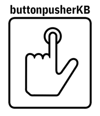

**buttonpusherKB** is a suite I use to create an efficient Post-Production Keyboard Interface that works for me. It may work for you. Or you may some useful pieces to pull out of here for your own use. Have a look.

Based on the [2nd keyboard](https://github.com/TaranVH/2nd-keyboard) project by TaranVH, this suite of [AutoHotKey](https://www.autohotkey.com/) scripts (and a few other files) provide a framework for making efficient use of a keyboard and some other input devices for the work I do in post-production.

I'm guessing you are here because you are involved in the front lines of post-production. And you use common apps like Adobe's Creative Cloud, DaVinci Resolve, and others - keep reading. I'm also guessing that you are interested in implementing a higher level of input to control the hardware and software you use to do your work. Maybe the current set of generic keyboard shortcuts aren't enough. Maybe you find that the default keyboard layout is not working for you or your working style. Maybe you want to incorporate alternative keyboard input devices - macropads, things like [Elgato's StreamDeck](https://www.elgato.com/en/gaming/stream-deck), [Contour's Shuttle Pro2](https://www.contourdesign.com/product/shuttle/), or other hardware like it. Maybe you're just interested in learning some programming. Maybe you're interested in automating the repetitive steps that our work brings us. Maybe you consider yourself a power-user who likes to make your systems do things that the original programmers didn't quite think of or make available.

OK, so if you're into all that...you might actually be me...no, but seriously, those are the reasons I created and use all this. If you're at all interested in this stuff then you'll dig this.

# OK, but what does this thing do?!?

The single biggest question I get asked is: ***What can I do with this set of scripts?***

I'm super glad you asked, random Internet Visitor! In a nutshell, _it depends_. I know, I know - that's a cop out answer. But, it's not - let me explain by giving you some of the highlights of what _buttonpusherKB_ has to offer:

- Sets up an environment that makes it easy to launch and control several aspects of your system
- Reduces repetitive tasks
- Is built as a modular system. You can use as much or as little as you want.
- Is based on AutoHotKey (for hot key shortcuts) and other simple, powerful apps.
- Creates an eco-system that allows flexible adjustment of your setup - just having a foundation in place, makes it easier to make small tweaks without needing to invent some new piece.

Here are some of the specific features I've incorporated:
- **MASTER-SCRIPT.ahk** - this is where you can setup hot keys that will work across your entire system.
- **Hotkey Scripts** - Hotkeys for specific apps, like: Premiere Pro, Illustrator, etc (there's a bunch of things in there - details below)
- **DRAKE** - a simple project management system that allows you to specify 4 Projects and then have quick access via Stream Deck shortcuts
- **CHEAT SHEETS** - quickly reveal a cheat sheet of all the commands you’ve setup in a specific app and get a reminder of where the command you are looking for is set.
- **STREAMDECK** - there are several items that you coukd use to incorporate these scripts into a StreamDeck setup. More info will be posted soon - for now you can look in the SCRIPTS-UTIL/STREAMDECK folder.
- **BATCH FILES TO ASSIST WITH BACKUPS** - run daily, weekly, and/or monthly backups of things like settings files and configuration files. It's a simple file copy, so it can go to cloud services easily.

There's a lot you can do, so it really does depend on how much or how little you want to integrate into your setup.

A little about me: I’m an editor with over 30 years experience in post-production. I got my start in linear, tape-based suites and quickly transitioned to non-linear systems as the field evolved. I’m a nut for tweaking the interface of my systems. In recent years, I’ve begun integrating custom and programmable keypads and other devices into my workflow.

The scripts here represent a destination, of sorts, of this journey I’ve been on for years. The combination of: apps like AutoHotKey, flexible programmable devices like Elgato’s StreamDeck, and fully-programmable keyboards (and keypads) have allowed me to raise the level of customization very high. This is way, way, beyond changing some keys in Premiere Pro.

Before you dive into this, please be aware that this is super complex. I’ve put a lot of thought into all this. While I’ve tried (and will keep trying) to document and explain what & why I’ve built things the way I have, I don’t know if anyone would want to just take my system and drop it into their own workflow. I present it all here, in its open-source glory so you can pull out the bits that you want for yourself.

Finally, while I know and have learned enough about AutoHotKey to be dangerous, I am *not* a programmer. I’m certain that I have coded some of this stuff in some stupid ways. I guess that’s also why I’ve put it all here on Github, so that I can refine it and make it better. For the most part,  it works for me, so I’m ok with the code not being perfectly optimized.

One last thing: this whole suite only works on Windows systems. Eventually I will adapt this effort for OSX (using [Keyboard Maestro](https://www.keyboardmaestro.com/main/) most likely, but of course there’s always [HammerSpoon](https://www.hammerspoon.org)...). I use both platforms pretty regularly, so it will happen *eventually*.

Now, on with the show...

## Getting Started

To make use of this suite, there are just a few things you’ll need to do.

1.  Install [AutoHotKey](https://www.autohotkey.com/) - download & install the latest stable version.
2.  Download this whole repository and unzip it into a folder in the root of your system drive. Mine is located in C:\BKB. I have it installed on 3 systems and the only thing that I have to tweak on each system is the settings.ini file (more on that later)
3.  When you first launch the suite (by launching the file: `BKB-startup.ahk`) the script will set up some things for you that it needs. It will ask for Admin access - please grant it so that it can set the Environment Variable needed (found at `BKB_ROOT`). And then it will launch the rest of the suite (`BKB-LAUNCHER.ahk` & `MASTER-SCRIPT.ahk` etc.)
4.  That’s pretty much all you need to get going...well, there’s the whole *getting-inside-Ben’s-brain-thing* but other than that, you’re all set. 😜
5.  Visit the [Wiki of this Repository](https://github.com/buttonpushertv/buttonpushertv-Post-Production-Keyboard-Interface/wiki) - this is where I will go through what the scripts do & my thinking behind them.

## Authors

* **Ben Howard** - [Buttonpushertv-Github](https://github.com/Buttonpushertv) - [Twitter](http://twitter.com/buttonpusher) - [Post-Op Media](http://postopmedia.com) (where I work)

## License

This project is licensed under the MIT License - see the [LICENSE.md](LICENSE.md) file for details

## Acknowledgments

* Inspried by TaranVH and his [2nd keyboard](https://github.com/TaranVH/2nd-keyboard) Project
